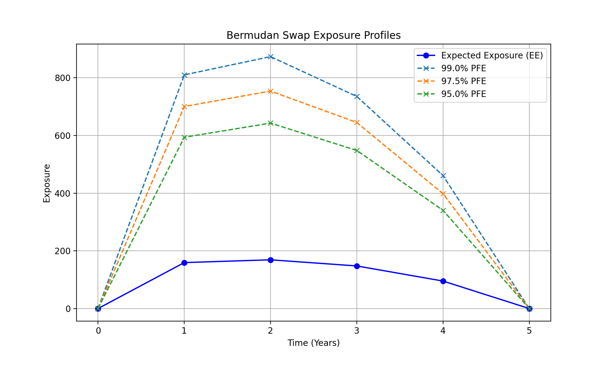

# Bermudan Interest Rate Swap Pricing & CVA (Monte Carlo Simulation)

This repository implements a Monte Carlo framework to price Bermudan interest rate swaps and compute related XVA metrics (EE, PFE, CVA).  

The short rate is modeled using a 1-factor Hull–White model, and Least Squares Monte Carlo (LSM) is used to determine the optimal exercise strategy.

---

## Overview

This code computes:

- Bermudan swaption option premium
- Expected Exposure (EE)
- Potential Future Exposure (PFE)
- Credit Valuation Adjustment (CVA)

---

## Interest Rate Model

The short rate $ r(t) $ follows a 1-factor Hull–White model:

$$
dr(t) = \alpha \big(b(t) - r(t)\big) dt + \sigma dW(t)
$$

- $\alpha$: mean reversion speed  
- $\sigma$: volatility  
- $b(t)$: time-dependent drift calibrated to the market yield curve

---

## Calibration

The drift $b(t)$ is calibrated so that the model reproduces the initial yield curve:

$$
b(t) = \frac{1}{\alpha}\frac{\partial f(0,t)}{\partial t} + f(0,t) + \frac{\sigma^2}{2\alpha^2}(1 - e^{-2 \alpha t})
$$

where $f(0,t)$ is the instantaneous forward rate at time 0.

---

## State Variables

We jointly sample:

- Short rate: $r(t)$ 
- Accumulated rate: 

$$
Y(t) = \int_0^t r(u)\ du
$$

This allows stable computation of discount factors.

---

## Discount Factor

The discount factor is given by:

$$
\beta(t) = \exp(-Y(t))
$$

---

## Bermudan Swap Structure

The exercisable dates are:

$$\{T_1, T_2, \dots, T_M\}$$

### Contract rules

- $t = 0 \sim T_1$: lockout period (exercise not allowed)  
- Exercise allowed at $T_i$ 
- If exercised at $T_i$, the swap starts from the next period until maturity $T_{M+1}$

Example:

- Exercising at $T_2$ → cashflows occur from $T_3$ to $T_{M+1}$

---

## Strike Determination

The strike rate $K$ is set such that the swap has zero value at initiation:

$$
V_{\text{swap}}(0) = 0
$$

---

## Least Squares Monte Carlo (LSM)

The optimal exercise strategy is determined using LSM:

### Continuation value approximation

$$
C(t_i, x) \approx \sum_k \beta_k \phi_k(x)
$$

- $x = (r(t_i), Y(t_i))$
- $\phi_k$: basis functions (e.g., polynomials)  
- $\beta_k$: regression coefficients

### Exercise rule

$$
\text{exercise if } V_{\text{exercise}} > C(t_i, x)
$$

---

## Exposure Metrics

### Expected Exposure (EE)

$$
EE(t) = \mathbb{E}[\max(V(t), 0)]
$$

---

### Potential Future Exposure (PFE)

$$
PFE_{\alpha}(t) = \inf \{ x : \mathbb{P}(V(t) \le x) \ge \alpha \}
$$

(e.g., 95.0%, 97.5%, 99.0% quantile)

---

## CVA Computation

The CVA is approximated by:

$$
CVA = (1-R) \int_0^T DF(t) \, EE(t) \, dPD(t)
$$

or in discrete form:

$$
CVA \approx (1-R) \sum_i DF(t_i) \, EE(t_i) \, \Delta PD(t_i)
$$

- $R$: recovery rate (e.g. 0.4)
- $PD(t)$: default probability  

---

## Numerical Scheme

- Monte Carlo simulation  
- Joint sampling of $r(t)$ and $Y(t)$
- Euler discretization  
- LSM regression at exercise dates  
- Pathwise aggregation for exposures

---

## Output

The code produces:

- Bermudan swaption price  
- Exposure profile (EE / PFE)  
- CVA estimate

---

## References

1. F. A. Longstaff and E. S. Schwartz. Valuing American Options by Simulation: A Simple Least-Squares Approach. *The Review of Financial Studies*, 14(1):113–147, 2001.
2. Glasserman, P. (2003) *Monte Carlo Methods in Financial Engineering*. Springer, New York.

---
